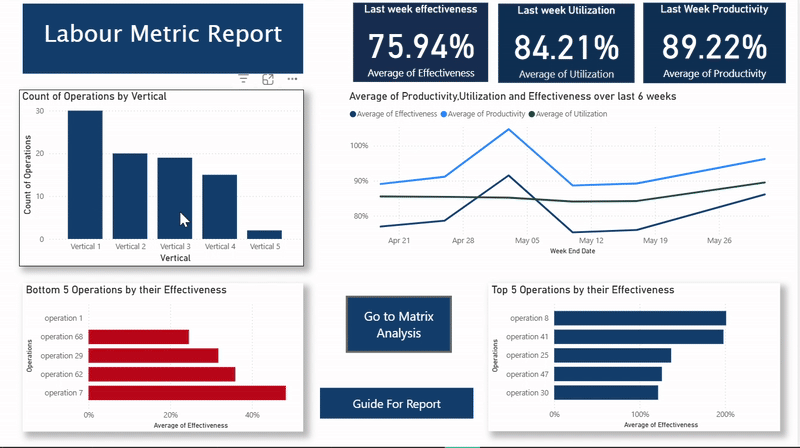
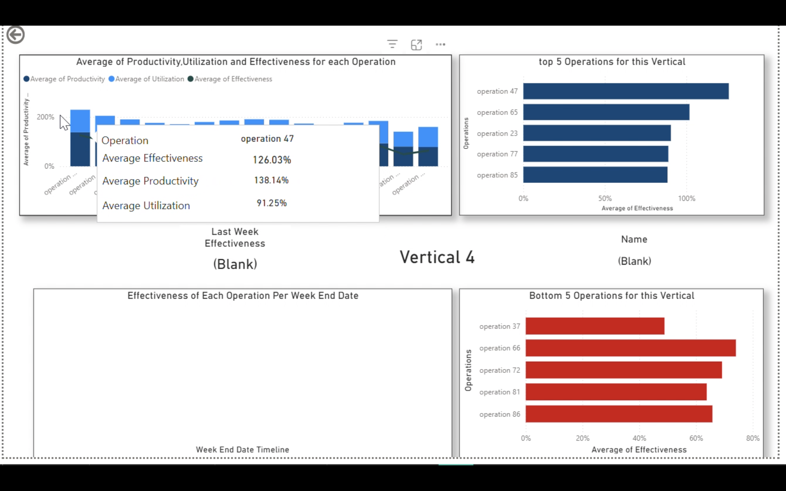

# 📈 Labour Metrics Dashboard (FedEx Internship Project)

This is an interactive dashboard built in Power BI to provide real-time insights into warehouse operations, tracking KPIs like Productivity, Efficiency, and Utilization.

## 🚀 Live Demo

Here is a demo of the dashboard's interactivity, conditional formatting, and drill-through features.

---

## 🔑 Key Features

* **Interactive Visuals:** All charts are cross-filtered to allow for deep-dive analysis.
* **Custom Tooltips:** Hovering over a data point reveals a custom-built card with more detailed metrics.
* **Python Forecasting:** Integrates a Python script to forecast top-performing operations.
* **Complex DAX:** Uses advanced DAX measures to calculate custom KPIs like 'Productivity vs. Target'.
* **Data Modeling:** Built on a star schema data model for optimal performance and scalability.

## 📊 Dashboard Screenshots

#### Custom Tooltip in Action

#### Summary Page (Full View)

####  DAX Date Slicer

---

## 🛠️ Technologies Used

* Power BI
* DAX
* Power Query (M)
* Python (for forecasting)
* SQL
